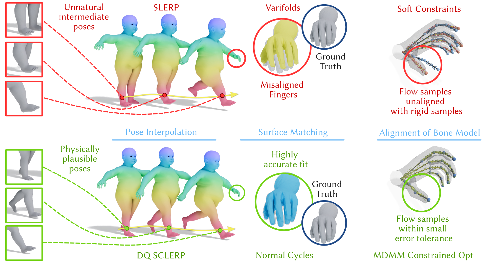

# Curvature Enthusiasm

[![CC BY-SA 4.0][cc-by-sa-shield]][cc-by-sa]
[](https://www.python.org/downloads/)
[](https://github.com/google/jax)

This work is licensed under a
[Creative Commons Attribution-ShareAlike 4.0 International License][cc-by-sa].

[![CC BY-SA 4.0][cc-by-sa-image]][cc-by-sa]

[cc-by-sa]: http://creativecommons.org/licenses/by-sa/4.0/
[cc-by-sa-image]: https://licensebuttons.net/l/by-sa/4.0/88x31.png
[cc-by-sa-shield]: https://img.shields.io/badge/License-CC%20BY--SA%204.0-lightgrey.svg


This repository contains the official code release for **Curvature Enthusiasm — Correspondence-Free Interpolation and Matching of Articulated 3D Shapes using Compressed Normal Cycles**

## Table of Contents

- [Key Features](#key-features)
- [Requirements](#requirements)
- [Installation](#installation)
- [Quick Start](#quick-start)
- [Command-line Arguments](#command-line-arguments)
- [Usage Examples](#usage-examples)
- [File Formats](#file-formats)
- [Project Structure](#project-structure)
- [Configuration Files](#configuration-files)
- [Troubleshooting](#troubleshooting)
- [Contributing](#contributing)
- [Citation](#citation)
- [License](#license)

## Key Features

An unsupervised method for physically plausible interpolation and dense correspondence recovery between pairs of articulated 3D shapes.

- Learning diffeomorphic deformations between articulated 3D shapes using Neural ODEs.
- Skeleton augmentation: The source mesh is augmented with a lightweight skeleton, resolving pose symmetries and enabling kinematic constraints without manual rigging.
- Curvature-aware surface matching: Compressed Normal Cycles capture high-curvature regions with precision, yielding highly accurate dense correspondences while remaining computationally efficient.
- Physically consistent kinematics: Dual quaternion–based skeletal formulation ensures realistic articulation and smooth interpolation.
- Constraint-driven optimisation: Hard constraints guarantee rigid skeletal alignment, avoiding manual loss weighting and yielding consistent, plausible deformations.

## Requirements

- Python **3.10–3.12**
- NVIDIA GPU with drivers supporting **CUDA 12.8**
- Linux (tested on Ubuntu 22.04)

## Installation

It is strongly recommended to install into a fresh virtual environment to avoid dependency conflicts.  
You can use either **venv** or **conda**:

### Using `venv`:
```bash
python -m venv curvature
source curvature/bin/activate
```

### Using `conda`:
```bash
conda create -n curvature-enthusiasm python=3.12
conda activate curvature-enthusiasm
```

## Project setup with `pyproject.toml`

This repository is configured as a standard Python package using [`pyproject.toml`](./pyproject.toml).  

- **Core dependencies** (Equinox, Optax, etc.)
- **Optional extras**:
  - `[dev]` → installs developer tools (pytest, linters, etc.)

To install using the TOML configuration:

### 1. Clone the repo
```bash
git clone https://github.com/yourusername/curvature-enthusiasm.git
cd curvature-enthusiasm
```

### 2. Install dependencies

Due to differing runtime cuda runtimes versions used by Pytorch and JAX, Pytorch must be installed first, then JAX.

#### Step 2a. Install PyTorch (CUDA 12.8 wheels)
PyTorch wheels are distributed via their own index, not PyPI:
```bash
pip install torch==2.8.0+cu128 --index-url https://download.pytorch.org/whl/cu128
```

#### Step 2b. Install JAX (CUDA 12.8)
```bash
pip install --upgrade "jax[cuda12]==0.7.2" -f https://storage.googleapis.com/jax-releases/jax_cuda_releases.html
```

#### Step 2c. Install the rest of the dependencies
```bash
pip install -e .
```

### 3. External Dependency: fTetWild

This project depends on [fTetWild](https://github.com/wildmeshing/fTetWild) for tetrahedral meshing. It must be built manually before running certain parts of the code.

#### Build Instructions

```bash
git clone https://github.com/wildmeshing/fTetWild.git
cd fTetWild
mkdir -p build && cd build
cmake ..
make -j$(nproc)
```

### 4. Verify Installation

Test that the package is correctly installed:
```bash
python -c "import curvature_enthusiasm; print('Installation successful!')"
```

## Quick Start

Basic example for shape interpolation:
```bash
python calc_interpolation.py --config configs/example.yaml \
    --start_pose01_01r.obj \
    --end_pose 01_02r.obj \
    --skeleton_type tgf \
    --skeleton_file test_skel.tgf \
    --key_points_file 01_01r-01_02r.txt
```

## Command-line Arguments

All arguments can be viewed with:
```bash
python calc_interpolation.py --help
```

### Required Arguments

- `--start_pose <mesh>`  
  Starting pose mesh file (default: `01_01r`).  
  Supports: `.obj`, `.off`, `.ply` formats.

- `--end_pose <mesh>`  
  Ending pose mesh file (default: `01_02r`).  
  Supports: `.obj`, `.off`, `.ply` formats.

### Optional Arguments

- `--config <file>`  
  Path to the YAML configuration file (default: `mano_config.yaml`).  
  See [Configuration Files](#configuration-files) for details.

- `--skeleton_type <type>`  
  Type of skeleton to use (default: `default`).  
  **Choices:**
  - `default` — use dataset default procedural skeleton  
  - `smpl` — generate SMPL skeleton procedurally  
  - `skel` — generate generic procedural skeleton  
  - `tgf` — load skeleton from a `.tgf` file (requires `--skeleton_file`)  

- `--skeleton_file <file>`  
  Path to a `.tgf` skeleton file.  
  **Required if** `--skeleton_type=tgf`.

- `--key_points_file <file>`  
  Path to a sparse correspondence file (optional).  
  If not provided, the script checks `data/<dataset_name>/keypoints/<start_pose>-<end_pose>.txt`.  
  Format: Plain text file with one vertex index pair per line.

- `--corres_mode <mode>`  
  Dense correspondence mode (default: `identity`).  
  **Choices:**
  - `none` — no dense correspondences used  
  - `identity` — assumes same topology between meshes (vertex-to-vertex mapping)  
  - `files` — load ground-truth correspondences from `.vts` files (requires `--gt_corres_files`)  

- `--gt_corres_files <file1> <file2>`  
  Pair of `.vts` files containing ground-truth correspondences for source and target meshes.  
  **Required if** `--corres_mode=files`.  
  Must specify exactly two files in order: `[source.vts, target.vts]`.

## Usage Examples

### Basic Usage

Use dataset default skeleton:
```bash
python calc_interpolation.py --config configs/example.yaml \
    --start_pose data/example/meshes/01_01r.obj \
    --end_pose data/example/meshes/01_02r.obj \
    --skeleton_type default
```

### With SMPL Skeleton

Use SMPL skeleton for human body shapes:
```bash
python calc_interpolation.py --config configs/smpl.yaml \
    --start_pose data/smpl/meshes/pose_a.obj \
    --end_pose data/smpl/meshes/pose_b.obj \
    --skeleton_type smpl
```

### With Custom Skeleton

Use skeleton loaded from `.tgf` file:
```bash
python calc_interpolation.py --config configs/custom.yaml \
    --start_pose data/custom/meshes/shape_a.obj \
    --end_pose data/custom/meshes/shape_b.obj \
    --skeleton_type tgf \
    --skeleton_file data/custom/skeletons/custom_skel.tgf
```

### With Sparse Keypoints

Provide sparse correspondences to guide the optimization:
```bash
python calc_interpolation.py --config configs/example.yaml \
    --start_pose data/example/meshes/01_01r.obj \
    --end_pose data/example/meshes/01_02r.obj \
    --key_points_file data/example/keypoints/01_01r-01_02r.txt
```

### With Ground-truth Dense Correspondences

Use pre-computed dense correspondences from `.vts` files:
```bash
python calc_interpolation.py --config configs/example.yaml \
    --start_pose data/example/meshes/01_01r.obj \
    --end_pose data/example/meshes/01_02r.obj \
    --corres_mode files \
    --gt_corres_files data/example/corres/source.vts data/example/corres/target.vts
```

### Identity Correspondences (Same Topology)

When meshes share the same vertex ordering:
```bash
python calc_interpolation.py --config configs/example.yaml \
    --start_pose data/example/meshes/01_01r.obj \
    --end_pose data/example/meshes/01_02r.obj \
    --corres_mode identity
```

## File Formats

### Supported Mesh Formats

- **OBJ** (`.obj`) — Wavefront OBJ format (recommended)
- **OFF** (`.off`) — Object File Format
- **PLY** (`.ply`) — Polygon File Format

Meshes should be:
- Reasonably tessellated (not too coarse or too fine)
- In a consistent coordinate system and scale

### Mesh Preprocessing

**Mesh preprocessing is enabled by default** and automatically normalizes input meshes to work optimally with Neural ODEs.

#### Why Preprocessing?

Neural ODEs work best at a specific scale. By default, all meshes are:
1. **Centered** at the origin (based on the source mesh centroid)
2. **Rescaled** to have a volume equal to that of a unit sphere: $V = \frac{4\pi}{3} \approx 4.189$

#### Standard Normalization

For datasets without custom preprocessing, the system:
- Computes the source mesh volume (using exact volume for watertight meshes, or convex hull for open meshes)
- Applies a uniform scale factor to both source and target meshes: $s = \sqrt[3]{\frac{V_{\text{desired}}}{V_{\text{current}}}}$
- Maintains the exact relative positioning between source and target

#### Dataset-Specific Preprocessing

Some datasets have bespoke preprocessing pipelines that may include:
- Center-of-gravity alignment
- Min-bounding-box alignment  
- Correspondence-based offset adjustments

These are defined in `curvature_enthusiasm/data/mesh_preprocessing.py` and automatically applied based on the `DATASET_NAME` in your configuration file.

#### Customizing Preprocessing

To change the target volume, modify the `desired_volume` parameter in your dataset loader, or register a custom preprocessor in `mesh_preprocessing.py`.

### Keypoints File Format

Plain text file with sparse correspondences, one pair per line:
```
<source_vertex_index> <target_vertex_index>
<source_vertex_index> <target_vertex_index>
...
```

Example (`keypoints/01_01r-01_02r.txt`):
```
0 0
145 152
389 401
1024 1056
```

Vertex indices are 0-based and must be valid for their respective meshes.

### Correspondence Files (`.vts`)

`.vts` files contain dense vertex-to-vertex correspondences. These are binary files storing:
- Source mesh vertex indices
- Target mesh vertex indices
- Correspondence weights (optional)

These files are typically generated by external correspondence algorithms or manual annotation tools.

### Skeleton Files (`.tgf`)

Trivial Graph Format (`.tgf`) files define skeletal structures:
```
# Nodes (vertex_id x y z)
0 0.0 0.0 0.0
1 0.0 1.0 0.0
2 0.0 2.0 0.0
#
# Edges (source_id target_id)
0 1
1 2
```

#### Building Custom Skeletons

You can create custom `.tgf` skeleton files for your meshes using the interactive skeleton-builder tool:
- **Repository**: [https://github.com/alecjacobson/skeleton-builder](https://github.com/alecjacobson/skeleton-builder)
- **Usage**: Load your mesh and interactively place skeleton nodes and edges, then export to `.tgf` format

## Project Structure

Code layout:

```
curvature-enthusiasm/
├── calc_interpolation.py          # Main training script
├── configs/                        # Configuration files
│   └── *.yaml
├── curvature_enthusiasm/           # Package source code
│   ├── losses/                     # Loss function implementations
│   ├── metrics/                    # Evaluation metrics
│   ├── model/                      # Neural ODE models
│   ├── utils/                      # Utility functions
│   └── train.py                    # Training loop
├── data/                           # Dataset directory
│   └── <DATASET_NAME>/             # e.g., MANO, SMPL, FAUST
│       ├── keypoints/              # Sparse correspondences (optional)
│       │   └── *.txt
│       ├── meshes/                 # Input mesh files
│       │   └── *.obj
├── experiments/                    # Experiment tracking (optional)
├── results/                        # Output directory (auto-created)
│   └── <DATASET_NAME>/
│       └── <experiment_id>/        # e.g., MANO_01_01r-01_02r
│           ├── analytic/           # Analytical results
│           ├── animation/          # Animation files
│           ├── results.txt         # Summary metrics
│           ├── *.eqx               # Saved model checkpoint
│           ├── source.obj          # Source mesh
│           ├── target.obj          # Target mesh
│           └── source_tet_shape.obj # Tetrahedral mesh
└── visualisations/                 # Visualization outputs (optional)
```

### Dataset Organization

Each dataset should be organized under `data/<DATASET_NAME>/`:

- **`meshes/`** — Input surface meshes (`.obj`, `.off`, `.ply`)
- **`keypoints/`** — Sparse correspondence files (`.txt`)

### Output Structure

After training completes, results are saved to `results/<DATASET_NAME>/<experiment_id>/`:

- **`source.obj`** — Source mesh (copied for reference)
- **`target.obj`** — Target mesh (copied for reference)
- **`source_tet_shape.obj`** — Tetrahedral mesh visualization
- **`*.eqx`** — Saved Equinox model checkpoint (e.g., `MANO_01_01r-01_02r_nc.eqx`)
- **`results.txt`** — Evaluation metrics and summary statistics
- **`analytic/`** — Analytical visualizations and data
- **`animation/`** — Interpolation sequence animations and intermediate meshes

### Experiment Naming

Results directories are automatically named based on:
- Dataset name (from config `DATASET.DATASET_NAME`)
- Source and target mesh names
- Training configuration hash (optional)

Example: `results/MANO/MANO_01_01r-01_02r/`

## Configuration Files

Configuration files (`.yaml`) control training hyperparameters, optimization settings, and model behavior.

### Example Configuration Structure

```yaml
DATASET:
  DATASET_NAME: 'MANO'
  REMESH: False

OPT:
  PEAK_LR: 3.0e-3
  END_LR: 1.0e-4
  WARMUP_STEPS: 100

NODE:
  N_ODE_STEPS: 10
  USE_DIV_FREE: False
  ACTIVATION_FUNC: "gelu"

BONE_SAMPLING:
  N_TISSUE_SAMPLES_PER_ITER: 2000
  N_RIGID_SAMPLES_PER_BONE: 50
  AXIS_RADII:
    0: [0.05]
    1: [0.1]
    2: [0.1]
    # ... per-bone radii configuration (list of radii for each bone)

VARIFOLD_INITIALISATION:
  SIGMAS: [1.0, 0.5]
  SIGMA_SPHS: [1.0, 0.5]
  INITIALISATION_ITERS: [1000]

NORMAL_CYCLES:
  SIGMAS: [0.5, 0.25, 0.1]
  ITERS_PER_LENGTHSCALE: [1000, 1000, 1000]

CONSTRAINTS:
  BONE_SAMPLE_EP: 1.0e1
  BONE_SAMPLE_TRAJ: 1.0
  SURFACE_ACAP: 5.0e3
  TISSUE_ACAP: 1.0e1

FINE_TUNING:
  USE_FINE_TUNING: True
  FT_NUM_ITERS: 2000
  BONE_SAMPLE_EP: 2.0e2
  BONE_SAMPLE_TRAJ: 5.0
  SURFACE_ACAP: 5.0e3
  TISSUE_ACAP: 1.0e1

COMPRESSION:
  COMPRESS_SOURCE: False
  COMPRESS_TARGET: False
  COMPRESSED_VARIFOLD_SOURCE_SIZE: 4000
  COMPRESSED_VARIFOLD_TARGET_SIZE: 4000
  COMPRESSED_NORMAL_CYCLE_SOURCE_SIZE: 6000
  COMPRESSED_NORMAL_CYCLE_TARGET_SIZE: 6000

RESULTS:
  LOAD_FROM_FILE: False
  RESULTS_DIR: 'results/'
  EVAL_TRAINGING_DATA: False
  PERCENTAGE_EVAL_SEQ: 10.0
```

### Configuration Parameters

#### Dataset Settings (`DATASET`)

- **`DATASET_NAME`** — Name of the dataset (e.g., 'MANO', 'SMPL', 'FAUST')
- **`REMESH`** — Whether to remesh input geometry before processing

#### Optimization Settings (`OPT`)

- **`PEAK_LR`** — Peak learning rate during training (default: `3.0e-3`)
- **`END_LR`** — Final learning rate after decay (default: `1.0e-4`)
- **`WARMUP_STEPS`** — Number of warmup steps for learning rate schedule

#### Neural ODE Settings (`NODE`)

- **`N_ODE_STEPS`** — Number of time steps for ODE solver (default: `10`)
- **`USE_DIV_FREE`** — Use divergence-free velocity field constraint
- **`ACTIVATION_FUNC`** — Neural network activation function (`"gelu"`, `"relu"`, `"swish"`)

#### Bone Sampling (`BONE_SAMPLING`)

- **`N_TISSUE_SAMPLES_PER_ITER`** — Number of tissue samples per training iteration
- **`N_RIGID_SAMPLES_PER_BONE`** — Number of rigid samples per skeletal bone
- **`AXIS_RADII`** — Per-bone list of radii for sampling regions around each bone axis. Each bone can have one or more radius values specified as a list. Bone indices correspond to skeleton structure.

#### Varifold Initialization (`VARIFOLD_INITIALISATION`)

- **`SIGMAS`** — Multi-scale Gaussian kernel bandwidths (coarse to fine)
- **`SIGMA_SPHS`** — Multi-scale Spherical kernel bandwidths
- **`ITERS_PER_LENGTHSCALE`** —  Training iterations at each length scale

#### Normal Cycles Matching (`NORMAL_CYCLES`)

- **`SIGMAS`** — Multi-scale Gaussian kernel bandwidths (coarse to fine)
- **`ITERS_PER_LENGTHSCALE`** — Training iterations at each length scale

#### Constraint Weights (`CONSTRAINTS`)

Hard constraints ensuring physically plausible deformations:

- **`BONE_SAMPLE_EP`** — Endpoint bone alignment constraint weight
- **`BONE_SAMPLE_TRAJ`** — Trajectory bone alignment constraint weight
- **`SURFACE_ACAP`** — Surface As-Conformal-As-Possible (ACAP) constraint weight
- **`TISSUE_ACAP`** — Tissue ACAP constraint weight
- **`KEY_POINTS_EP`** — Key points matching weight

#### Fine-tuning (`FINE_TUNING`)

- **`USE_FINE_TUNING`** — Enable fine-tuning phase after main training
- **`FT_NUM_ITERS`** — Number of fine-tuning iterations
- **`BONE_SAMPLE_EP`** — Increased endpoint constraint for fine-tuning
- **`BONE_SAMPLE_TRAJ`** — Increased trajectory constraint for fine-tuning
- **`SURFACE_ACAP`** — Surface constraint during fine-tuning
- **`TISSUE_ACAP`** — Tissue constraint during fine-tuning

#### Compression (`COMPRESSION`)

- **`COMPRESS_SOURCE`** — Compress source mesh
- **`COMPRESS_TARGET`** — Compress target mesh
- **`COMPRESSED_VARIFOLD_SOURCE_SIZE`** — Number of source compressed points for varifold matching
- **`COMPRESSED_VARIFOLD_TARGET_SIZE`** — Number of target compressed points for varifold matching
- **`COMPRESSED_NORMAL_CYCLE_SOURCE_SIZE`** — Number of source compressed points for normal cycle matching
- **`COMPRESSED_NORMAL_CYCLE_TARGET_SIZE`** — Number of target compressed points for normal cycle matching

#### Results (`RESULTS`)

- **`LOAD_FROM_FILE`** — Load pre-trained model from checkpoint instead of training
- **`RESULTS_DIR`** — Output directory for results and visualizations
- **`EVAL_TRAINGING_DATA`** — Evaluate on training data after completion
- **`PERCENTAGE_EVAL_SEQ`** — Percentage of interpolation sequence to evaluate

### Tips for Tuning Configuration

**For faster convergence:**
- Increase `PEAK_LR` to `5.0e-3`
- Reduce `NORMAL_CYCLES.ITERS_PER_LENGTHSCALE` values
- Disable fine-tuning: set `USE_FINE_TUNING: False`

**For higher quality results:**
- Use more length scales in `NORMAL_CYCLES.SIGMAS` (e.g., `[1.0, 0.5, 0.25, 0.1, 0.05]`)
- Increase iterations per length scale
- Enable fine-tuning with more iterations

**For large deformations:**
- Increase `BONE_SAMPLE_EP` and `BONE_SAMPLE_TRAJ` constraint weights
- Use coarser initial sigma in `NORMAL_CYCLES.SIGMAS`

**For memory constraints:**
- Reduce `N_TISSUE_SAMPLES_PER_ITER` and `N_RIGID_SAMPLES_PER_BONE`
- Enable compression: `COMPRESS_TARGET: True` with smaller `COMPRESSED_SIZE`

## Troubleshooting

### Common Issues

#### `GLIBCXX_3.4.30 not found` error

Install the latest libstdc++:
```bash
conda install -c conda-forge libstdcxx-ng
```

#### CUDA version mismatch

Ensure your NVIDIA drivers support CUDA 12.8:
```bash
nvidia-smi  # Check driver version
```

If your driver is older, consider using compatible JAX/PyTorch versions or upgrading drivers.

#### PyKeOps build failures

Test if PyKeOps can access GCC and CUDA:
```python
import pykeops
pykeops.test_torch_bindings()
```

Expected output:
```
pyKeOps with torch bindings is working!
```

More help: [PyKeOps - Getting Started](https://www.kernel-operations.io/keops/python/installation.html)

#### Out of memory errors

Reduce GPU memory usage by adjusting the environment variable:
```bash
export XLA_PYTHON_CLIENT_MEM_FRACTION=0.3  # Use 30% of GPU memory
```

Or modify directly in `calc_interpolation.py`.

#### File not found errors

Ensure your file paths are correct:
- Use absolute paths or paths relative to the script location
- Check that mesh files exist: `ls data/example/meshes/`
- Verify file permissions: `ls -la data/example/meshes/01_01r.obj`

### Getting Help

If you encounter issues not covered here:

1. Check the [GitHub Issues](https://github.com/yourusername/curvature-enthusiasm/issues) for similar problems
2. Search [Discussions](https://github.com/yourusername/curvature-enthusiasm/discussions)
3. Open a new issue with:
   - Full error message
   - Your environment details (OS, Python version, GPU model)
   - Minimal reproduction steps
   - Configuration file (if applicable)

## Contributing

We welcome contributions! See [CONTRIBUTING.md](CONTRIBUTING.md) for guidelines.

Areas where contributions are particularly valuable:
- Additional dataset loaders
- New skeleton generation methods
- Improved correspondence metrics
- Documentation improvements
- Bug fixes and performance optimizations

## Citation

If you find this work useful, please cite our paper:

```bibtex
@article{hartshorne2025curvature,
  title={Curvature Enthusiasm: Correspondence-Free Interpolation and Matching of Articulated 3D Shapes using Compressed Normal Cycles},
  author={Hartshorne, Adam and Paul, Allen and Shardlow, Tony and Campbell, Neill D. F.},
  journal={ACM Transactions on Graphics},
  year={2025}
}
```

## License

This software is licensed under the Apache License 2.0. See [LICENSE](LICENSE) for details.

## Acknowledgments  

This project builds on excellent JAX contributions from:  
- [ProbDiffEq](https://github.com/pnkraemer/probdiffeq) — Probabilistic solvers for differential equations
- [Equinox](https://github.com/patrick-kidger/equinox) — JAX neural network library
- [Torch2Jax](https://github.com/rdyro/torch2jax/) — PyTorch to JAX conversion utilities

## Community

- **GitHub Issues**: [Bug reports and feature requests](https://github.com/yourusername/curvature-enthusiasm/issues)
- **Discussions**: [Community forum](https://github.com/yourusername/curvature-enthusiasm/discussions)
- **Email**: ath35@bath.ac.uk

---